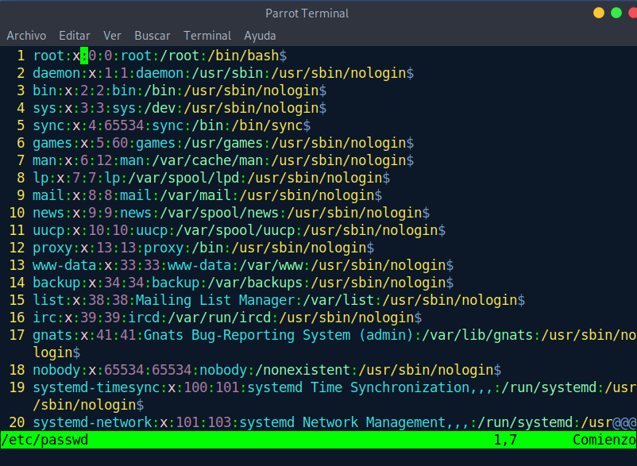
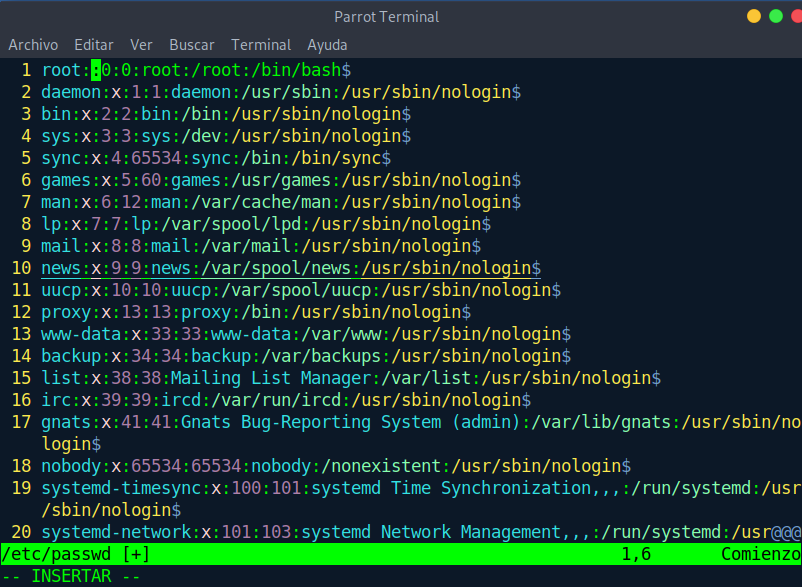
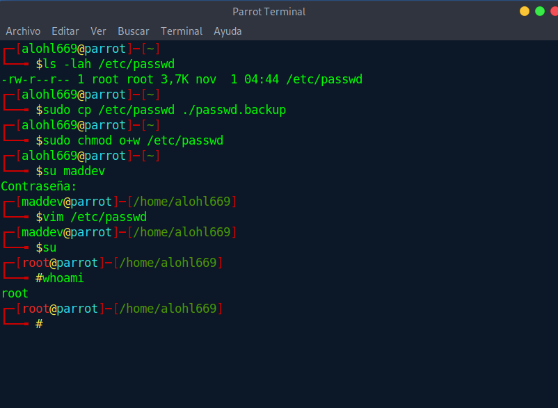
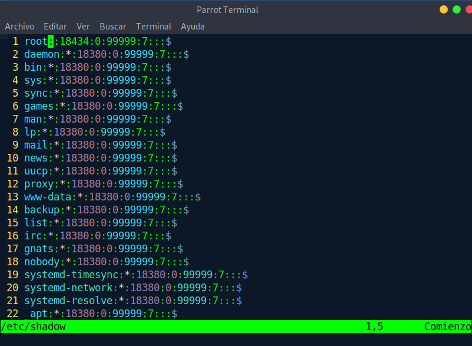
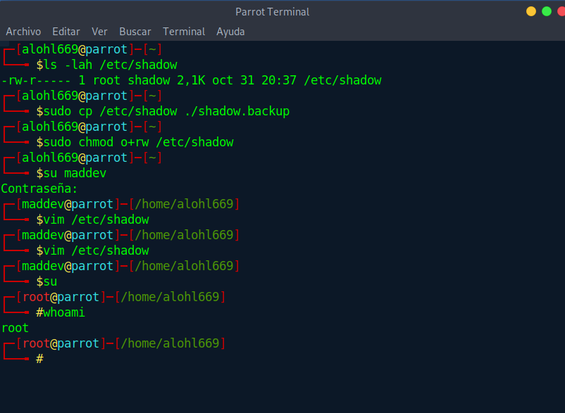
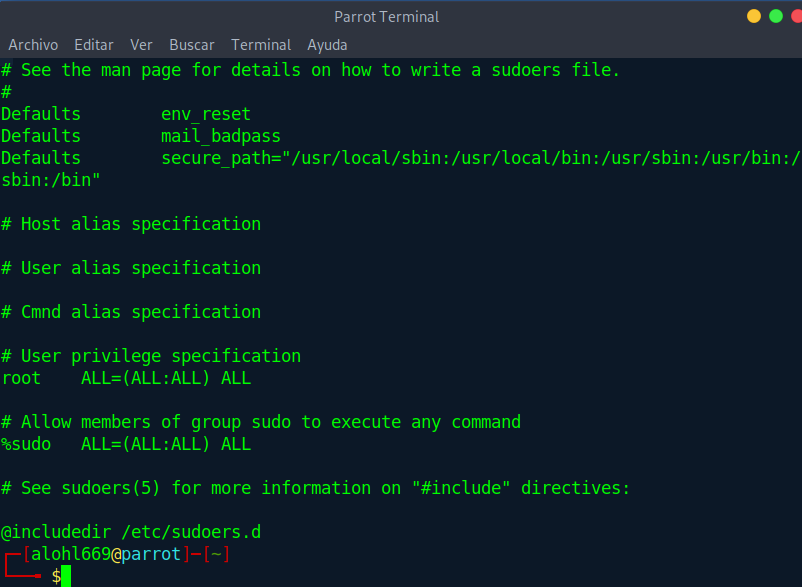
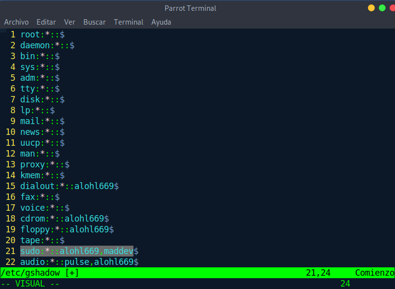
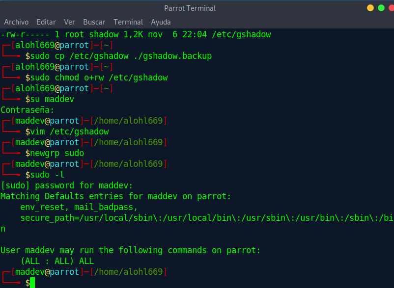

# Critical files

Previously a vague explanation was given of the dangers that would exist if ```/etc/sudoers``` were a modifiable file, but little effort and attention was given to the fact that it is a file that does not necessarily come by default in all linux distributions, although the vast majority do.

Given the situation of being found with write permission for a usually unprivileged group like "*other*" it would be so easy to get privileges by adding a single line
```
echo "maddev  ALL=(ALL:ALL)   ALL" >> /etc/sudoers
```

But this would not be the only file that would involve a risk. In the class video, several files are mentioned among them:

1. On the one hand we have ```/etc/shadow```, which must remain with the privileges intact. This is so important that not even the group "*other*" has reading permissions to avoid, as specified in the video, trying to break the pass by using brute force.

2. On the other hand we have ```/etc/passwd``` . This is actually the one mentioned in the video indicating that by putting our own encrypted password in the second position of the root line we would ignore your password stored in ```/etc/shadow```. What is not mentioned is that we don't even need to replace the second field. It would be enough to remove the "*x*" from the second field to be able to log in as root without even having to enter a password




3. Since we have mentioned the danger of a missing password for the root user, let's check again if this would happen in the same way with the ```/etc/shadow``` file  



**BINGO!**

4. Finally there is the file ```/etc/gshadow``` (not ```/etc/group```). Normally you would think that not all files owned by root are manipulable by the root group (shadow does not write to the root group). But this is where the ```/etc/sudoers``` file comes in again. I explain myself, before I have mentioned how to modify sudoers to obtain sudo privileges with a single user, however, in modern distributions (this same distribution or centos 8) they already begin to come with a peculiar configuration in sudoers to avoid visudo, etc. If we look at parrot sudoers we see the following


```%sudo    ALL=(ALL:ALL)  ALL```
> %wheel on centos

And this doesn't mean anything else that everyone who belongs to the group "*sudo*"(or "*wheel*" in centos) can execute any command, well, in fact it puts it in the file itself. Therefore, if "*other*" could modify the ```/etc/gshadow``` file to add themselves to the sudo group, they could execute any command.

And for that you would only have to log in to the sudo group with
```
newgrp sudo
```


