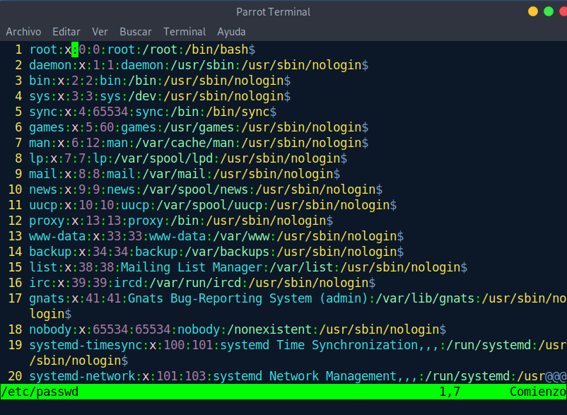
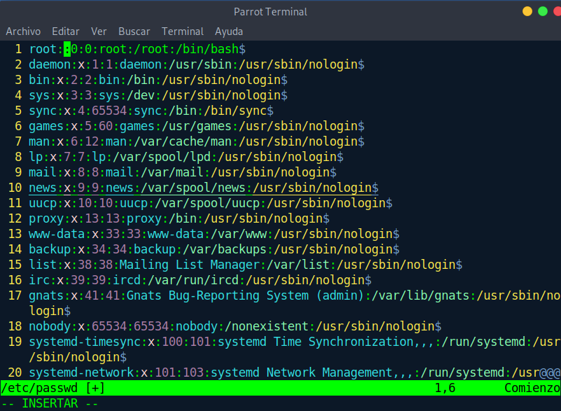
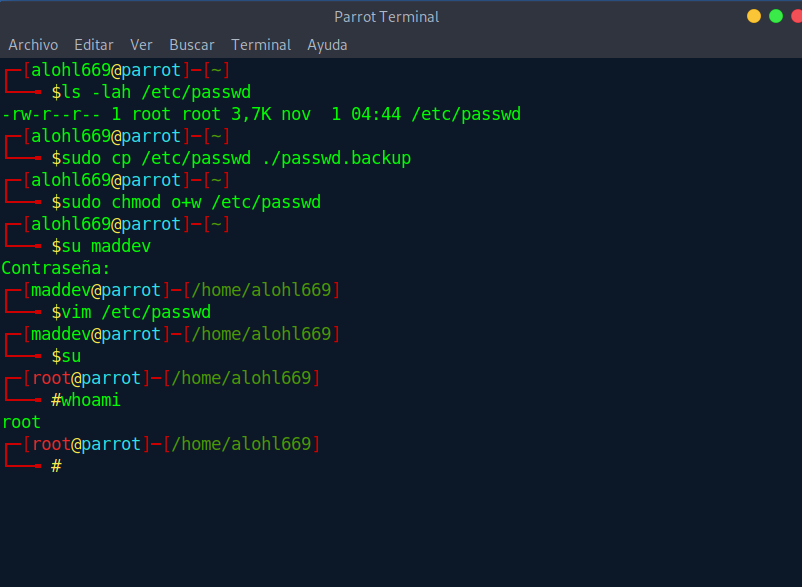
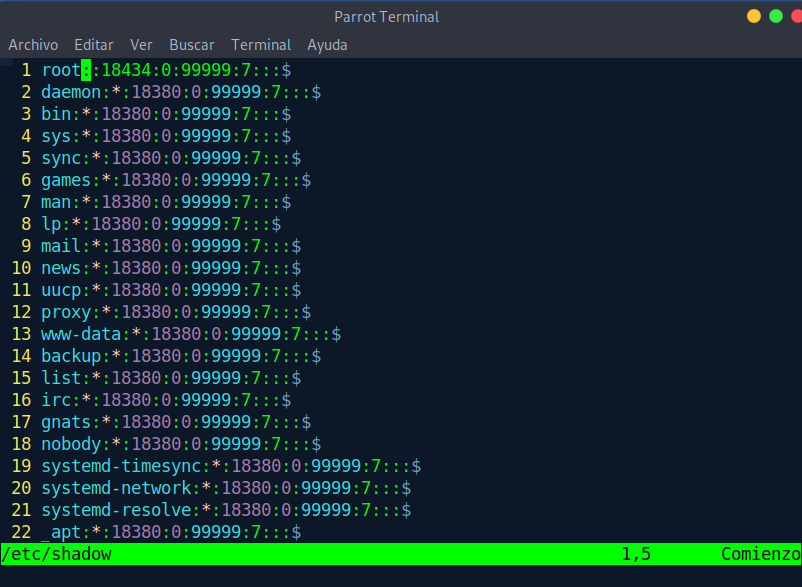
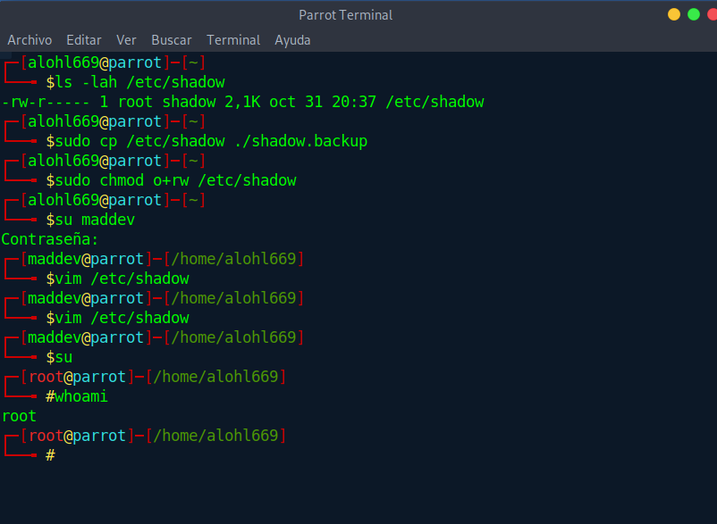
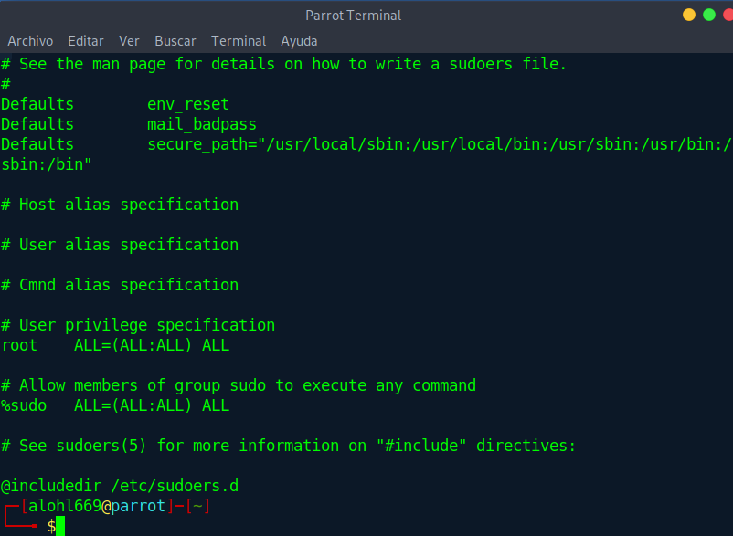
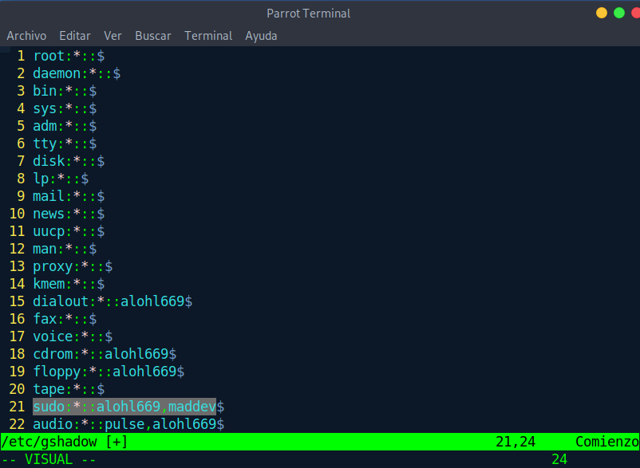
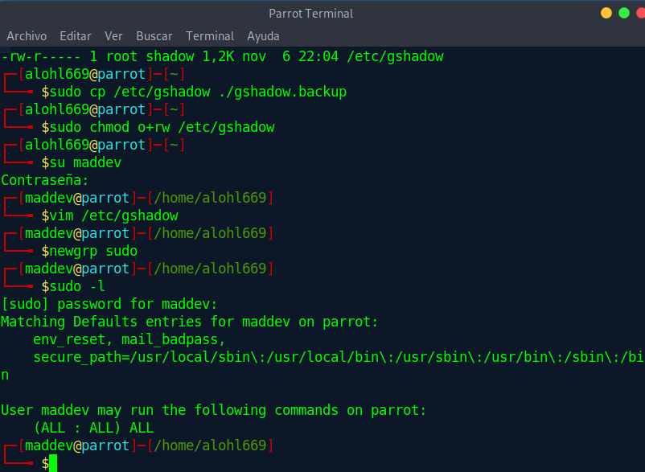

# Ficheros críticos

Anteriormente se hizo una explicación vaga de los peligros que existirían si ```/etc/sudoers``` fuera un fichero modificable, pero se puso poco esfuerzo y atención al tratarse de un fichero que no viene necesariamente por defecto en todas las distribuciones linux, aunque si en su gran mayoría.

Dada la situación de encontrárselo con permisos de escritura para un grupo habitualmente no privilegiado como "*otros*" seria tan fácil conseguir privilegios añadiendo una sola linea
```
echo "maddev  ALL=(ALL:ALL)   ALL" >> /etc/sudoers
```

Pero este no sería el único fichero que implicaría un riesgo. En el video de la clase se mencionan entre ellos varios archivos:

1. Por un lado tenemos ```/etc/shadow```, el cual debe permanecer con los privilegios intactos. Llega hasta tal importancia esto que ni siquiera el grupo "*otros*" tiene permisos de lectura para evitar, como se especifica en el video, intentar romper el pass mediante el uso de fuerza bruta.

2. Por otro lado disponemos de ```/etc/passwd``` . Efectivamente es el que se menciona en el vídeo indicando que poniendo nuestro propio password cifrado en la segunda posición de la linea de root ignoraríamos su contraseña almacenada en ```/etc/shadow```. Lo que no se menciona es que ni siquiera hace falta sustituir el segundo campo. Bastaría con eliminar la "*x*" del segundo campo para poder acceder como root sin necesidad siquiera de poner una contraseña




3. Ya que hemos mencionado el peligro de ausencia de contraseña en el usuario root vamos a comprobar de nuevo si esto sucederia del mismo modo con el fichero ```/etc/shadow```



**BINGO!**

4. Por último está el fichero ```/etc/gshadow```(vale, he picado y he pensado en primera instancia que valdría con ```/etc/group```, sin embargo parece que si existe info de un grupo en gshadow, group es abiertamente ignorado). Normalmente se podría pensar  que no todos los ficheros propiedad de root son manipulables por el grupo root(sin ir mas lejos shadow no otorga escritura al grupo root). Pero aquí es donde entra de nuevo el fichero ```/etc/sudoers```. Me explico, antes he mencionado como modificar sudoers para conseguir privilegios sudo con un solo usuario, sin embargo, en las distribuciones modernas(este mismo parrot o centos 8) ya empiezan a venir con una configuración peculiar en sudoers para evitar visudo, etc. Si nos fijamos en el sudoers de parrot vemos lo siguiente


```%sudo    ALL=(ALL:ALL)  ALL```
> %wheel en centos

Y esto no quiere decir otra cosa que todo aquel que pertenezca al grupo "*sudo*"(o "*wheel*" en centos) pueden ejecutar cualquier comando, bueno, de hecho lo pone en el propio archivo. Por lo tanto, si "*otros*" pudieran modificar el fichero ```/etc/gshadow``` para agregarse al grupo sudo, podrían ejecutar cualquier comando.

Y para ello solo tendría que logearse en el grupo sudo con
```
newgrp sudo
```


